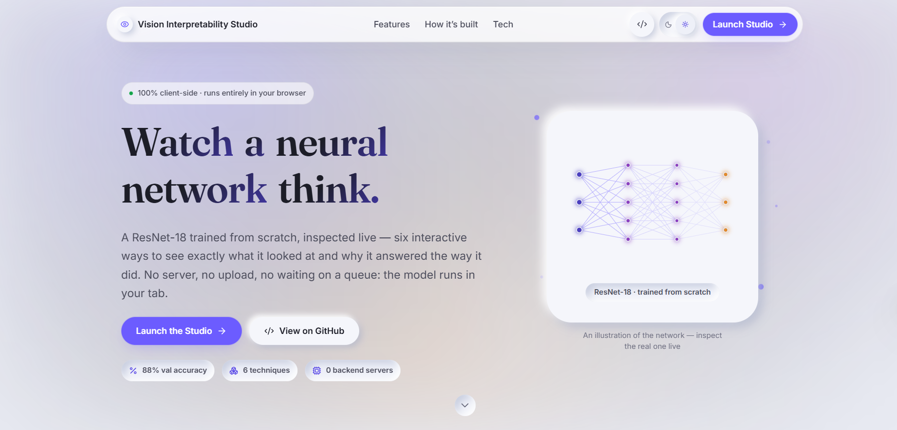
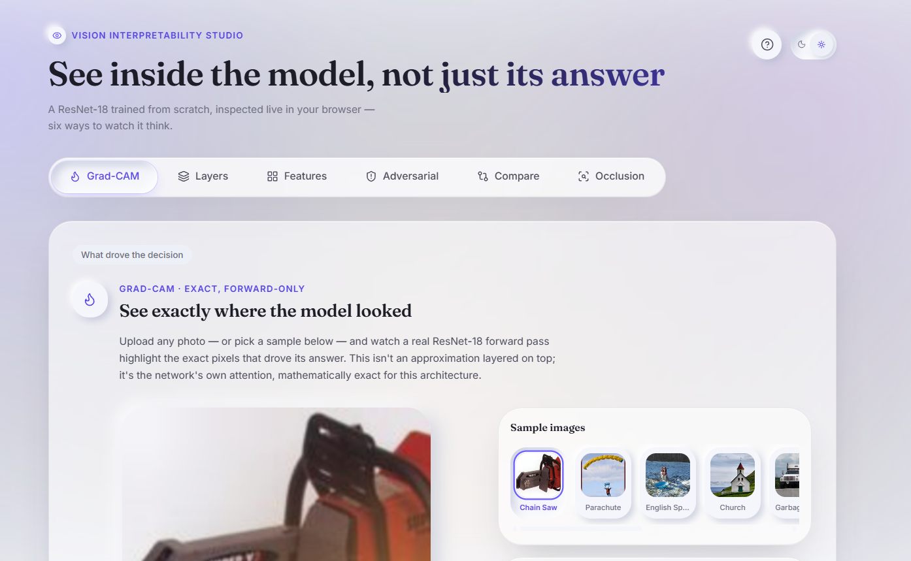
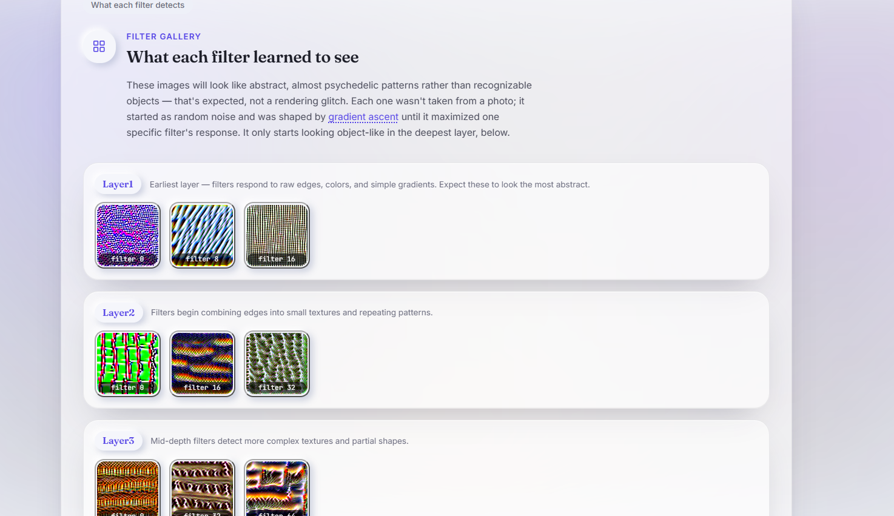

# Vision Interpretability Studio

[](https://github.com/Zephyrex21/vision-interpretability-studio/actions/workflows/ci.yml)
[](./LICENSE)

**An interactive, 100% client-side tool for seeing inside a trained vision
model** — six different ways to watch a ResNet-18 explain itself, live in
your browser. No backend, no upload, no cost.

**[Live demo →](https://vision-interpretability-studio.vercel.app)** ·
**[Full engineering write-up →](./CASE_STUDY.md)**



## What it does

Six tabs, each a genuinely different interpretability technique — not six
variations on the same trick:

| Tab             | What it shows                                                                |
| --------------- | ---------------------------------------------------------------------------- |
| **Grad-CAM**    | Exact (not approximated) pixel-level attention, live for any photo           |
| **Layers**      | Scrub through network depth and watch attention sharpen                      |
| **Features**    | Browse what individual filters learned to detect                             |
| **Adversarial** | Watch an invisible pixel nudge flip a confident, correct prediction          |
| **Compare**     | Live Grad-CAM next to a true, gradient-based Grad-CAM++                      |
| **Occlusion**   | Black-box confidence-drop sensitivity — no gradients, no model access at all |

<p>
  
  
</p>

## Why this is more than a Grad-CAM demo

Plain ONNX Runtime — including `onnxruntime-web`, the engine this app runs
on — is **inference-only**. No backpropagation, so "live Grad-CAM in the
browser" isn't something you get for free. The core engineering story here
is three different, real ways around that constraint:

- **An exact, zero-gradient trick for Grad-CAM.** For a network ending in
  `GlobalAveragePool → Linear`, Grad-CAM's gradient-based weighting is
  mathematically identical to that Linear layer's own weights — so the
  heatmap is computed with a single forward pass, no backprop, and it's
  exact, not approximated.
- **A hand-ported TensorFlow.js copy of the same model**, for the
  techniques (Grad-CAM++, adversarial attacks) that genuinely need real
  gradients — verified numerically against the original to 6 decimal
  places before being trusted.
- **A black-box occlusion sweep** that needs no gradients, no weights, and
  no access to the model's internals at all — it would work identically
  against a model with nothing exported.

Read the full write-up, including the most interesting thing the model
actually did → **[CASE_STUDY.md](./CASE_STUDY.md)**

## Tech stack

React · TypeScript · Vite · ONNX Runtime Web · TensorFlow.js · Framer
Motion · Vitest · Playwright · PyTorch (training only) · GitHub Actions ·
Vercel

## Quick start

Requires **Node.js 20+**.

```bash
git clone https://github.com/Zephyrex21/vision-interpretability-studio.git
cd vision-interpretability-studio/apps/web
npm install
npm run dev
```

Open the printed URL — that's the homepage. Click **Launch Studio**, or go
straight to `/app`, to reach the tool itself. The Grad-CAM tab loads a
sample image and runs real inference automatically (first load downloads
the ~43MB model + ~13MB WASM runtime, cached by the browser afterward).

## Testing

**47 unit tests** (Vitest — pure math + component behavior, run in
milliseconds) and **10 end-to-end tests** (Playwright — a real browser,
the real model, real inference), enforced in CI on every push. Run from
`apps/web/`:

```bash
npm run format:check && npm run lint && npx tsc -b && npm run test && npm run build
npx playwright install --with-deps chromium   # one-time
npm run test:e2e
```

`.github/workflows/ci.yml` runs a frontend job (format, lint, typecheck,
Vitest, build), a separate `e2e` job (real Chromium via Playwright), and
the `ml/` math tests (Python, numpy-only, no GPU) on every push and PR.

## The model

A ResNet-18 trained **from scratch** (not fine-tuned) on Imagenette —
88.2% validation accuracy — on Kaggle's free GPU tier. Training code and
the notebook are in [`ml/`](./ml).

## Repo layout

```
vision-interpretability-studio/
├── apps/
│   └── web/                        # React + Vite + TypeScript frontend
│       ├── public/
│       │   ├── models/             # model_gradcam.onnx, feature_viz/ images (fetched at runtime)
│       │   └── samples/            # 10 demo images from the Kaggle validation set
│       ├── src/
│       │   ├── pages/                # HomePage (marketing site, at /) and
│       │   │                         # StudioPage (the tool, at /app) — react-router-dom
│       │   ├── components/
│       │   │   ├── homepage/        # Navbar, Hero, FeatureGrid, HowItsBuilt,
│       │   │   │                    # TechStack, FinalCta, Footer, NetworkDiagram
│       │   │   ├── workbench/       # tool layout shell, tab navigation
│       │   │   ├── visualizations/  # GradCamView, LayersView, FeatureVizView,
│       │   │   │                    # AdversarialView, CompareView, OcclusionView
│       │   │   └── ui/              # shared primitives (ThemeToggle, TiltCard,
│       │   │                        # AnimatedCounter, BackgroundAtmosphere, etc.)
│       │   ├── lib/
│       │   │   ├── onnx/            # session setup, preprocessing, classify + exact Grad-CAM
│       │   │   └── gradcam/         # canvas heatmap rendering (bilinear upsample + color scale)
│       │   ├── data/                # bundled JSON: class labels, FC weights, sample/feature-viz/
│       │   │                        # adversarial/Grad-CAM++ metadata
│       │   ├── state/                # context objects, providers, and hooks (theme + workbench)
│       │   ├── styles/               # design tokens (tokens.css), global.css
│       │   └── test/                 # Vitest setup
│       ├── e2e/                      # Playwright specs — real browser, real model/weight files
│       ├── vercel.json                # SPA rewrite so /app doesn't 404 on refresh
│       └── playwright.config.ts
├── ml/
│   ├── notebooks/
│   │   └── vision_interpretability_phase1.ipynb   # Kaggle training notebook
│   ├── src/                  # gradcam.py, feature_viz.py, fgsm.py, export_onnx.py,
│   │                          # prepare_gradcam_export.py, test_math.py
│   ├── requirements.txt
│   └── README.md
├── docs/screenshots/          # README images
├── .github/workflows/ci.yml  # lint, typecheck, unit tests, e2e tests, build — every push/PR
└── README.md                 # you are here
```

## Design

A claymorphism system — every surface molded from the same material as
its background, distinguished by a light-side highlight + dark-side
shadow rather than a hard border. The signature interaction ties the
material to its function: an inactive tab or thumbnail sits raised off
the surface, and selecting it presses in, used consistently for every
genuinely toggleable control rather than an arbitrary color swap. See
`apps/web/src/styles/tokens.css` for the full token system.

## License

MIT © [Zephyrex21](https://github.com/Zephyrex21) — see [LICENSE](./LICENSE).
