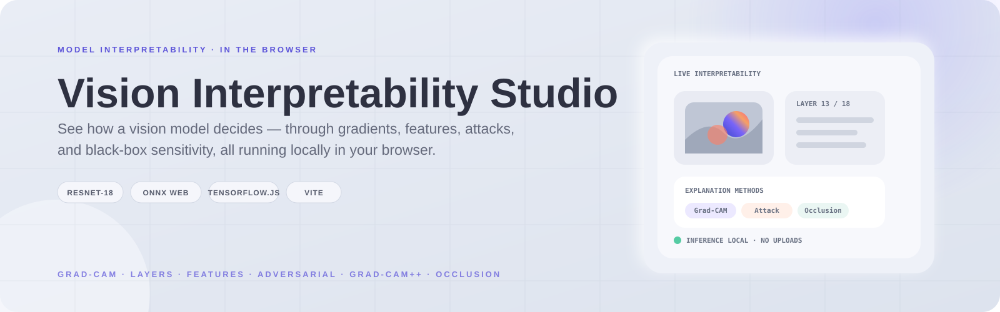
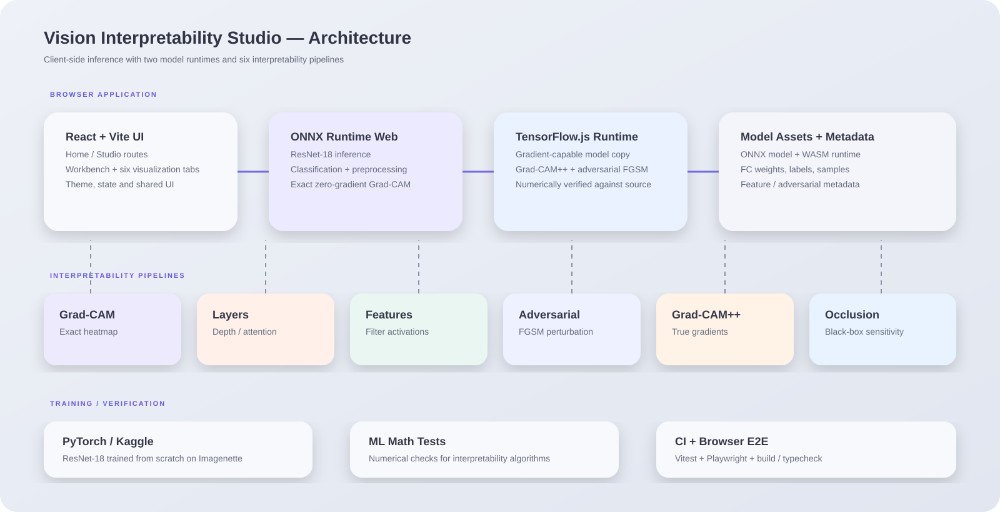

<p align="center">
  
</p>

# Vision Interpretability Studio

[](https://github.com/Zephyrex21/vision-interpretability-studio/actions/workflows/ci.yml)
[](./LICENSE)

**An interactive, 100% client-side tool for seeing inside a trained vision model** — six different ways to watch a ResNet-18 explain itself, live in your browser. No backend, no upload, no cost.

**[Live demo →](https://vision-interpretability-studio.vercel.app)** · **[Full engineering write-up →](./CASE_STUDY.md)**


## What it does

Six tabs, each a genuinely different interpretability technique — not six variations on the same trick:

| Tab | What it shows |
| --- | --- |
| **Grad-CAM** | Exact pixel-level attention for any supported image |
| **Layers** | Network depth and how attention changes through the model |
| **Features** | What individual filters learned to detect |
| **Adversarial** | How an invisible pixel perturbation can flip a prediction |
| **Compare** | Live Grad-CAM alongside true gradient-based Grad-CAM++ |
| **Occlusion** | Black-box confidence-drop sensitivity without gradients or model internals |

<p>
  
  
</p>

## Architecture

<p align="center">
  
</p>

The application is intentionally client-side: ONNX Runtime Web handles normal inference and exact zero-gradient Grad-CAM, while a hand-ported TensorFlow.js model provides the gradients required for Grad-CAM++ and adversarial attacks. A black-box occlusion pipeline requires neither gradients nor model internals.

## Why this is more than a Grad-CAM demo

Plain ONNX Runtime — including `onnxruntime-web`, the engine this app runs on — is **inference-only**. No backpropagation, so live gradient-based interpretability is not available out of the box.

This project solves that constraint in three different ways:

- **Exact zero-gradient Grad-CAM:** for a network ending in `GlobalAveragePool → Linear`, Grad-CAM's gradient weighting is mathematically identical to the Linear layer's weights, allowing an exact heatmap from a single forward pass.
- **Gradient-capable TensorFlow.js model:** a hand-ported copy of the same model supports Grad-CAM++ and adversarial attacks, with numerical verification against the original implementation.
- **Black-box occlusion:** confidence-drop sensitivity requires no gradients, weights, or access to model internals.

Read the full engineering analysis in **[CASE_STUDY.md](./CASE_STUDY.md)**.

## Tech stack

React · TypeScript · Vite · ONNX Runtime Web · TensorFlow.js · Framer Motion · Vitest · Playwright · PyTorch · GitHub Actions · Vercel

## Quick start

Requires **Node.js 20+**.

```bash
git clone https://github.com/Zephyrex21/vision-interpretability-studio.git
cd vision-interpretability-studio/apps/web
npm install
npm run dev
```

Open the printed URL. The Grad-CAM tab loads a sample image and runs real inference automatically. The first load downloads the model and WASM runtime; browser caching handles subsequent loads.

## Testing

The project has **47 unit tests** with Vitest and **10 end-to-end tests** with Playwright using a real browser and real model inference.

```bash
npm run format:check
npm run lint
npx tsc -b
npm run test
npm run build

npx playwright install --with-deps chromium
npm run test:e2e
```

CI runs formatting, linting, typechecking, unit tests, build, browser E2E tests, and the `ml/` numerical math tests on every push and pull request.

## The model

A **ResNet-18 trained from scratch** on Imagenette, reaching **88.2% validation accuracy**. Training code and the notebook are available in [`ml/`](./ml).

## Repo layout

```text
vision-interpretability-studio/
├── apps/
│   └── web/                  # React + Vite + TypeScript application
│       ├── src/
│       │   ├── pages/        # HomePage and StudioPage
│       │   ├── components/   # Workbench, visualizations and UI
│       │   ├── lib/          # ONNX inference + Grad-CAM rendering
│       │   ├── data/         # Labels, weights and visualization metadata
│       │   ├── state/        # Theme and workbench state
│       │   └── styles/       # Design tokens and global styles
│       ├── e2e/              # Playwright browser tests
│       └── public/           # Models and sample assets
├── ml/                       # PyTorch training + interpretability math
├── docs/screenshots/         # README screenshots
├── docs/architecture.svg    # High-level architecture diagram
└── .github/workflows/       # CI pipeline
```

## Design

A claymorphism system where surfaces are distinguished through light-side highlights and dark-side shadows rather than hard borders. The same material language is used throughout the workbench so interaction state remains visually consistent. See `apps/web/src/styles/tokens.css` for the token system.

## License

MIT © [Zephyrex21](https://github.com/Zephyrex21) — see [LICENSE](./LICENSE).
